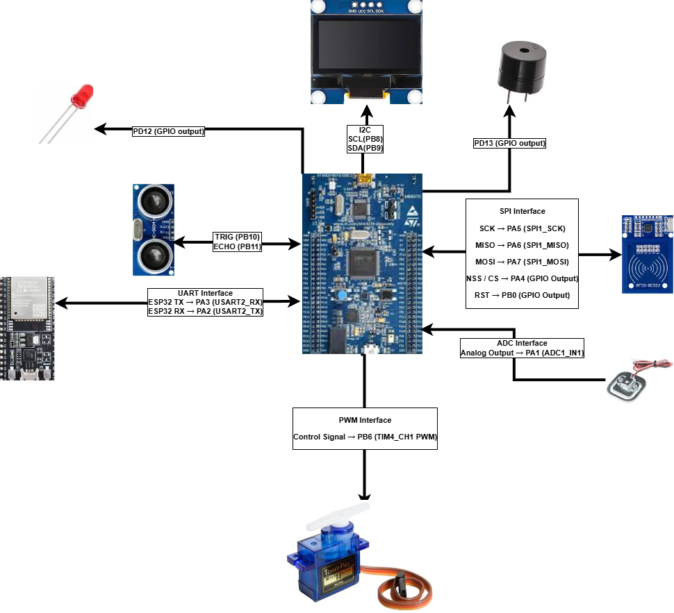

# Smart Parking Barrier System  
### Abdullah Gül University – Department of Electrical & Electronics Engineering  
### EE300 Project – STM32F407 Discovery Board  
### Contributors: Ahmet Emre Bilge • Fatih Mehmet Ayhan • Enes Erdoğan  
---

## 1. Project Overview

The **Smart Parking Barrier System** is an embedded automation project designed to control the access of electric vehicle (EV) charging areas.  
The system ensures that **only authorized EV users** can access charging spots, preventing unauthorized parking and increasing charging efficiency.  
The project is implemented on an **STM32F407 Discovery** microcontroller using **CMSIS register-level programming**. :contentReference[oaicite:0]{index=0}

The system includes:

- **RFID authorization** (MFRC522 – SPI)
- **Ultrasonic obstacle & vehicle detection**
- **Weight sensor** (Load cell analog input)
- **Servo-controlled automatic barrier**
- **ESP32 ESP-NOW wireless remote control**
- **OLED display (I²C)**
- **LED and buzzer indicators**

The system supports the **smart city concept** and demonstrates real-world embedded system design integrating sensors, actuators, and communication modules.

---

## 2. System Architecture

During power-up, the STM32 initializes all connected peripherals (RFID, ultrasonic sensor, servo, display, wireless module).  
The system enters **System Ready** mode until a vehicle approaches.  
If an RFID tag is authorized, the barrier opens automatically.  
Safety mechanisms such as obstacle detection and weight sensing ensure reliable operation.  
Wireless commands via ESP-NOW allow remote open/close operations.  

This architecture demonstrates:
- Multi-protocol communication (SPI, I²C, UART, PWM, ADC)
- Real-time interrupt-based operation  
- Modular and maintainable embedded software design :contentReference[oaicite:1]{index=1}

---

## 3. System Line Diagram

The complete hardware diagram (created for the project) is shown below:



> Make sure this file is stored at: `docs/line_diagram.png`

---

## 4. Hardware Components

| Component | Function |
|----------|----------|
| **STM32F407 Discovery** | Main MCU, CMSIS-based embedded controller |
| **RFID Reader (MFRC522)** | User authentication via SPI |
| **Ultrasonic Sensor (HC-SR04)** | Vehicle distance & obstacle detection |
| **Load Cell + Amplifier** | Detects whether a car is parked (ADC) |
| **ESP32 Module** | Wireless ESP-NOW remote operation |
| **OLED Display (SSD1306)** | Status messages and system feedback |
| **Servo Motor (SG90/MG90)** | Controls the barrier movement |
| **LED (PD12)** | Status indicator |
| **Buzzer (PD13)** | Warning / notification sound |

---

## 5. Pin Connections (Updated According to Latest Diagram)

Below is the final pin mapping extracted from the system line diagram.  
All pins are validated for the **STM32F407 Discovery** board.

### 🔌 **Pin Mapping Table**

| Peripheral | Pin(s) on STM32 | Interface | Direction | Description |
|-----------|------------------|-----------|-----------|-------------|
| **OLED Display** | PB8 (SCL), PB9 (SDA) | I²C1 | In/Out | System status display |
| **RFID Reader (MFRC522)** | PA5 (SCK) <br> PA6 (MISO) <br> PA7 (MOSI) <br> PA4 (NSS / CS) <br> PB0 (RST) | SPI1 | In/Out | RFID authentication module |
| **Ultrasonic Sensor** | PB10 (TRIG) <br> PB11 (ECHO) | GPIO + Timer | Out / In | Distance & obstacle detection |
| **Load Cell (Analog)** | PA1 (ADC1_IN1) | ADC | In | Vehicle presence via weight |
| **ESP32 (Wireless)** | PA3 (USART2_RX) <br> PA2 (USART2_TX) | UART | In/Out | ESP-NOW communication |
| **Servo Motor** | PB6 (TIM4_CH1 PWM) | PWM | Out | Barrier control |
| **LED** | PD12 | GPIO Output | Out | System indicator |
| **Buzzer** | PD13 | GPIO Output | Out | Warning tone |

---

## 6. Software Architecture

Software is designed using a **CMSIS-based layered structure**:

### **1) Driver Layer**
Low-level drivers written using **direct register access**, including:
- RCC clock enabling  
- GPIO configuration (MODER, OTYPER, OSPEEDR, PUPDR)  
- SPI1, I²C1, USART2 initialization  
- ADC configuration  
- TIM4 PWM generation  

### **2) Middleware Layer**
- SPI functions for MFRC522 RFID  
- I²C routines for OLED  
- UART communication with ESP32  
- PWM servo control abstraction  

### **3) Application Layer**
Implements system logic as a state machine:

| State | Description |
|-------|-------------|
| **IDLE** | System initialized – waiting |
| **WAIT_FOR_VEHICLE** | Ultrasonic distance monitoring |
| **AUTH_CHECK** | RFID card validation |
| **OPENING** | PWM-controlled servo movement |
| **OPEN** | Car entering zone |
| **CLOSING** | Closing after checks |
| **OBSTACLE_DETECTED** | Safety interrupt – stops motor |

The project follows a **cut-based (interrupt-driven)** design for real-time operation. :contentReference[oaicite:2]{index=2}

---

## 7. Register-Level GPIO Implementation

Per course requirements, **no HAL or CubeMX is used**.  
All configurations are done using **CMSIS + direct register programming**.

Example register operations used in this project:

- `RCC->AHB1ENR |= (1 << 3);` → Enable GPIOD clock  
- `GPIOD->MODER |= (1 << 24);` → Set PD12 as output  
- `GPIOA->AFR[0] |= (7 << 8);` → Configure PA2 for USART2  
- `TIM4->CCR1 = duty;` → PWM pulse width  
- `ADC1->DR` → Read analog sensor value  

This ensures:
- Maximum performance  
- Full control of MCU peripherals  
- Deep understanding of hardware behavior  

---

## 8. Project Folder Structure

```text
Smart-Parking-Barrier/
├── Src/                     # Source files (main.c, rfid.c, oled.c, esp32.c…)
├── Inc/                     # Header files
├── Docs/
│   ├── proposal_onepage.pdf
│   ├── line_diagram.png
│   └── register_notes.md
├── Hardware/                # Schematics, sensor datasheets
├── README.md
└── .gitignore
